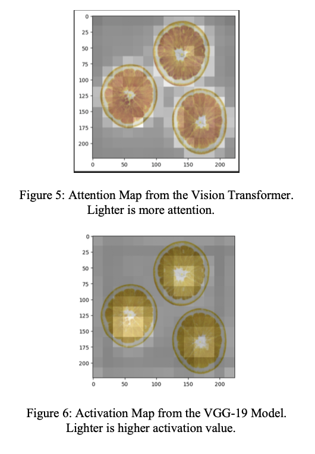
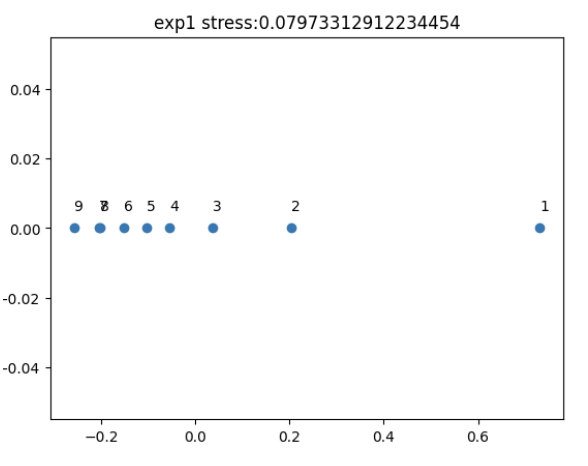
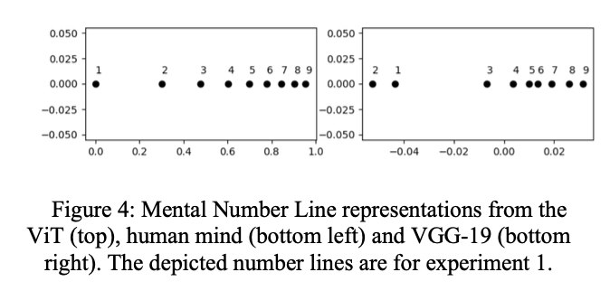

# Numerosity-ViT
Exploring the numerosity effects for Vision Transformers (ViTs) and Convolutional Neural Networks (CNNs). Repo contains paper along with the code for our experiments and training.

**Paper located [here](paper.pdf)**

---

## Findings:

### Abstract

Numerosity, the ability to visually discriminate quantities of items, has long been a subject of inquiry in cognitive science. Prior works using CNNs seem to pick up on numerosity without an explicit training objective geared towards the concept itself. Newer models like vision transformers (ViTs) have shown to achieve state-of-the-art performance and stronger understandings of long-range dependencies; experimenting with ViTs’ ability to comprehend numerosity is a promising area of research and can provide insight as to whether the human-alignment observed with CNNs is architecture specific. In this work, we use a pre-trained ViT and experiment with its ability to understand various types of numerosity stimuli. We show competitive results against VGG-19 models and even outperform in certain tests. We further analyze our results using attention maps and activation maps.

### Select Figures
Attention Maps                           |  Mental Number Lines
:---------------------------------------:|:-------------------------:
 |  

### Comparison of R^2 Values For Ratio Effect

Experiment | VGG-19 R^2 | ViT R^2
:---------:|:----------:|:-------:
1 | **0.9954** | 0.9352
2 | **0.9133** | 0.8350
3 | 0.9226 | **0.9533**
4 | 0.7815 | **0.9632**
5 | **0.9235** | 0.8985
6 | 0.4892 | **0.6166**
